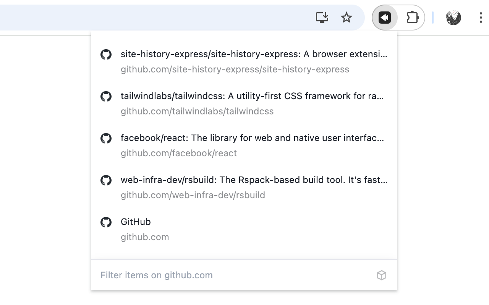

简体中文 | [English](./README.zh-CN.md)

# Site History Express - 全局历史记录版本

Site History Express 是一款便捷的浏览器扩展程序，可让你快速访问浏览历史记录。这个修改版本始终显示全局浏览历史记录，无论你当前在哪个网站。

## 🚀 主要特性

### 全局历史记录显示
- **全局模式**：无论在哪个页面点击扩展，都显示所有网站的浏览历史记录
- **快速搜索**：使用关键字搜索功能快速查找特定的历史记录页面
- **键盘导航**：支持键盘快捷键进行快速导航

### 键盘快捷键
- **上一个**：向上箭头键
- **下一个**：向下箭头键
- **向上跳转**：Shift + 向上箭头键
- **向下跳转**：Shift + 向下箭头键
- **打开**：Enter 键
- **新标签页打开**：Shift + Enter 键

### 自定义快捷键
1. 前往 `chrome://extensions/shortcuts`
2. 找到 Site History Express
3. 设置你的快捷键（例如 Ctrl + Shift + 8）

## 📦 安装

### 方式一：下载 CRX 文件（推荐）
1. 从 [Releases](https://github.com/CatechumenLee/site-history-express/releases) 页面下载最新的 `.crx` 文件
2. 在 Chrome 浏览器中打开 `chrome://extensions/`
3. 启用"开发者模式"
4. 将 `.crx` 文件拖拽到扩展页面中

### 方式二：手动构建
```bash
# 克隆仓库
git clone https://github.com/CatechumenLee/site-history-express.git
cd site-history-express

# 安装依赖
npm install

# 构建扩展
npm run build

# 在浏览器中加载 dist 目录
```

## 🛠️ 开发

这个项目使用以下技术栈：
- **React** + **TypeScript** + **Tailwind CSS**
- **Rsbuild** 作为构建工具

### 开发命令
```bash
# 启动开发服务器
npm run dev

# 构建扩展
npm run build
```

## 📄 许可证

本项目基于原项目 [site-history-express/site-history-express](https://github.com/site-history-express/site-history-express) 进行修改，遵循相同的开源许可证。

## 🔄 版本历史

### v1.3.0
- ✨ 新功能：始终显示全局浏览历史记录
- 🗑️ 移除：域名匹配模式切换功能
- 📝 更新：简化界面和交互逻辑
- 🐛 修复：优化历史记录加载性能